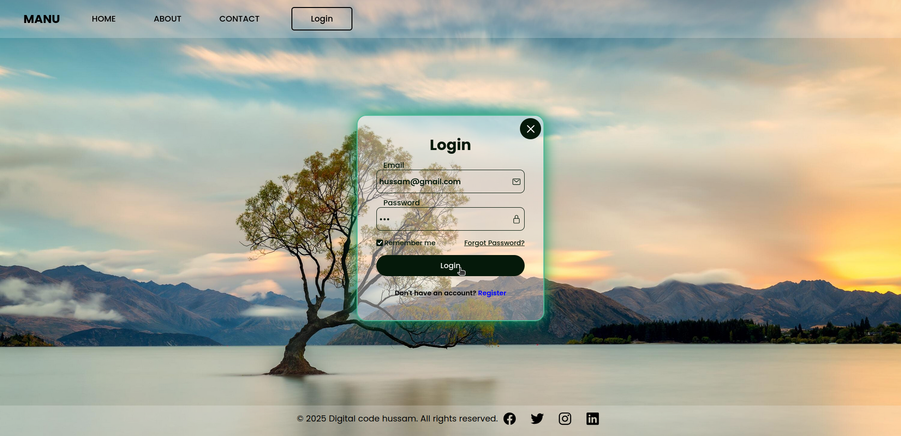
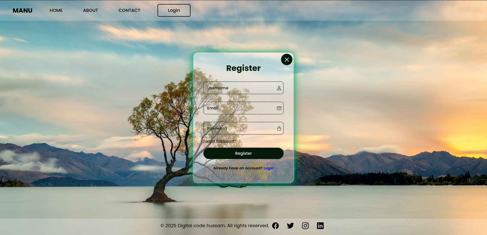

<p align="center">
    <h1 align="center" style="margin: 0 auto 0 auto;">LoginandRegister</h1>

<br>

## Translations
- ## [عربي](README.md)


************

## **User Management - Login and Registration System**

**Introduction:**

This project was developed using **Flask** and **MongoDB** to provide a user authentication system, allowing users to register and log in to access the main page.

**Program Sections:**

1. **User Registration:**
   Users can register with their email and password. The data is securely stored in the MongoDB database, with validation checks to ensure input correctness.

2. **User Login:**
   Users can log in using their email and password. The system verifies credentials and displays an error message if the input is incorrect.

3. **Home Page:**
   After successful login, users are redirected to the main page, where they can interact with other features.

4. **User Management:**
   The system includes functionality for adding new users, updating their information, or deleting accounts if needed.

**Technical Features:**

- **Flask**: Used as the backend framework to handle authentication and routing.
- **MongoDB**: A NoSQL database to securely store user data.
- **Validation & Verification**: Ensures that user inputs meet the required standards.
- **Database Synchronization**: All user data is securely stored in MongoDB, allowing seamless updates and deletions.

**Future Enhancements:**

- Add a password recovery feature via email.
- Improve the user interface with modern technologies like **HTML5**, **CSS3**, and **JavaScript**.
- Implement **JWT** (JSON Web Token) authentication for enhanced security.
- Enable social media login integration.

**Installation:**

To install and run the project, follow these steps:

1. **Install dependencies:**
   Ensure that **Python** and **MongoDB** are installed. Then install the required packages:

   ```bash
   pip install -r requirements.txt
   ```

2. **Run the server:**
   Start the application using:

   ```bash
   flask run
   ```

3. **Access the application:**
   Once the server is running, open your browser and navigate to:

   ```bash
   http://127.0.0.1:5000
   ```

**Conclusion:**

This project aims to enhance user management by providing a smooth and secure login and registration system. It can be further developed to include additional features based on user needs.

## 💻 Image

**************
<p align="center">

</p>
<p align="center">

</p>
<p align="center">

</p>
